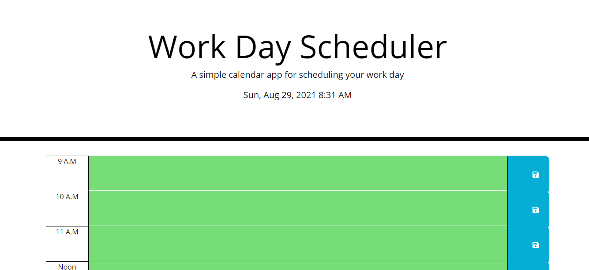

# DayPlanner
### This is my day scheduler 
### It shows an outline of someones work day from 9am to 5 pm
### It shows which hour is active corresponding with the actual time
### Each input is also stored in the local storage so user can reference their schedule
[Link to day planner](https://dannfirefight322.github.io/DayPlanner/)
  